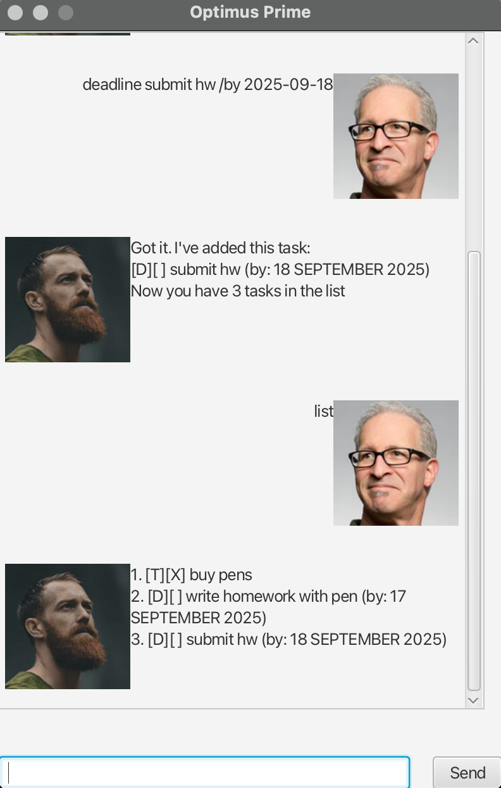

# 🤖 Optimus Prime Task Manager

<div align="center">



_A powerful task management application inspired by the legendary Autobot leader Optimus Prime_

</div>

---

## ✨ Features

- 🎯 **Three Task Types**: Todos, Deadlines, and Events
- ✅ **Task Management**: Mark tasks as complete/incomplete
- 🔍 **Smart Search**: Find tasks by keywords
- 📊 **Sorting**: Sort tasks by name or date (ascending/descending)
- 💾 **Persistent Storage**: Tasks are automatically saved
- 🖥️ **Dual Interface**: Both GUI and command-line support
- 🎨 **Modern UI**: Clean, intuitive JavaFX interface

---

## 🚀 Quick Start

### Prerequisites

- **JDK 17** or higher
- **IntelliJ IDEA** (recommended) or any Java IDE
- **JavaFX 17** (included in dependencies)

### Installation & Setup

1. **Clone the repository**

   ```bash
   git clone <repository-url>
   cd ip
   ```

2. **Open in IntelliJ IDEA**

   - Open IntelliJ IDEA
   - Click `File` > `Open`
   - Select the project directory
   - Accept all default prompts

3. **Configure JDK 17**

   - Go to `File` > `Project Structure` > `Project`
   - Set **Project SDK** to **JDK 17**
   - Set **Project language level** to `SDK default`

4. **Run the Application**

   **Option A: GUI Mode (Recommended)**

   ```bash
   ./gradlew run
   ```

   **Option B: Command Line Mode**

   - Right-click `src/main/java/optimusprime/OptimusPrime.java`
   - Select `Run OptimusPrime.main()`

### Expected Output

```
Hello! I'm Optimus Prime, Leader of the Autobots
What can I do for you?
```

---

## 📋 Available Commands

### Task Creation Commands

| Command    | Format                                        | Description                     | Example                                              |
| ---------- | --------------------------------------------- | ------------------------------- | ---------------------------------------------------- |
| `todo`     | `todo <description>`                          | Create a simple todo task       | `todo Buy groceries`                                 |
| `deadline` | `deadline <description> /by <date>`           | Create a task with deadline     | `deadline Submit report /by 2024-12-31`              |
| `event`    | `event <description> /from <start> /to <end>` | Create an event with time range | `event Team meeting /from 2024-01-15 /to 2024-01-15` |

### Task Management Commands

| Command  | Format                 | Description             | Example    |
| -------- | ---------------------- | ----------------------- | ---------- |
| `list`   | `list`                 | Display all tasks       | `list`     |
| `mark`   | `mark <task_number>`   | Mark task as complete   | `mark 1`   |
| `unmark` | `unmark <task_number>` | Mark task as incomplete | `unmark 1` |
| `delete` | `delete <task_number>` | Delete a task           | `delete 2` |

### Search & Organization Commands

| Command | Format                | Description                | Example               |
| ------- | --------------------- | -------------------------- | --------------------- |
| `find`  | `find <keyword>`      | Search tasks by keyword    | `find meeting`        |
| `sort`  | `sort <type> <order>` | Sort tasks by name or date | `sort date ascending` |

### System Commands

| Command | Format | Description          |
| ------- | ------ | -------------------- |
| `bye`   | `bye`  | Exit the application |

---

## 💡 Usage Examples

### Creating Tasks

```
> todo Read Transformers comics
Got it. I've added this task:
[T][ ] Read Transformers comics
Now you have 1 tasks in the list

> deadline Fix Optimus Prime /by 2024-12-25
Got it. I've added this task:
[D][ ] Fix Optimus Prime (by: 25 December 2024)
Now you have 2 tasks in the list

> event Autobot meeting /from 2024-01-15 /to 2024-01-15
Got it. I've added this task:
[E][ ] Autobot meeting (from: 15 January 2024 to: 15 January 2024)
Now you have 3 tasks in the list
```

### Managing Tasks

```
> list
1. [T][ ] Read Transformers comics
2. [D][ ] Fix Optimus Prime (by: 25 December 2024)
3. [E][ ] Autobot meeting (from: 15 January 2024 to: 15 January 2024)

> mark 1
Nice! I've marked this task as done:
[T][X] Read Transformers comics

> find meeting
Here are the matching tasks in your list:
1. [E][ ] Autobot meeting (from: 15 January 2024 to: 15 January 2024)
```

### Sorting Tasks

```
> sort date ascending
Understood. Here is your sorted list!

[T][X] Read Transformers comics
[E][ ] Autobot meeting (from: 15 January 2024 to: 15 January 2024)
[D][ ] Fix Optimus Prime (by: 25 December 2024)
```

---

## 🏗️ Project Structure

```
src/
├── main/
│   ├── java/optimusprime/
│   │   ├── gui/                 # JavaFX GUI components
│   │   │   ├── MainWindow.java  # Main GUI window
│   │   │   ├── DialogBox.java   # Chat dialog components
│   │   │   └── Launcher.java    # Application launcher
│   │   ├── tasks/               # Task management classes
│   │   │   ├── Task.java        # Base task class
│   │   │   ├── Todos.java       # Todo task implementation
│   │   │   ├── Deadlines.java   # Deadline task implementation
│   │   │   ├── Events.java      # Event task implementation
│   │   │   └── TaskList.java    # Task collection manager
│   │   ├── parser/              # Input parsing utilities
│   │   │   └── Parser.java      # Command and date parsing
│   │   ├── database/            # Data persistence
│   │   │   └── DatabaseHandler.java
│   │   ├── exceptions/          # Custom exceptions
│   │   └── OptimusPrime.java    # Main application logic
│   └── resources/               # GUI resources (images, FXML)
└── test/                        # Unit tests
```

---

## 🛠️ Building & Distribution

### Build JAR File

```bash
./gradlew shadowJar
```

The executable JAR will be created in `build/libs/OptimusPrime.jar`

### Run Tests

```bash
./gradlew test
```

### Check Code Style

```bash
./gradlew checkstyleMain
```

---

## 🎨 GUI Features

The application includes a modern JavaFX-based GUI with:

- 💬 **Chat Interface**: Interactive dialog with Optimus Prime
- 🖼️ **Custom Avatars**: User and Optimus Prime character images
- 📱 **Responsive Design**: Clean, modern interface
- ⌨️ **Keyboard Support**: Press Enter to send messages
- 🖱️ **Mouse Support**: Click Send button to submit

---

## ⚠️ Important Notes

- **Date Format**: Use `YYYY-MM-DD` format for all dates
- **Task Numbers**: Task numbering starts from 1 (not 0)
- **Data Persistence**: Tasks are automatically saved to `db.txt`
- **File Structure**: Keep the `src/main/java` folder structure intact for proper compilation

---

## 🤝 Contributing

1. Fork the repository
2. Create a feature branch (`git checkout -b feature/amazing-feature`)
3. Commit your changes (`git commit -m 'Add some amazing feature'`)
4. Push to the branch (`git push origin feature/amazing-feature`)
5. Open a Pull Request

---

<div align="center">

**"Autobots, Roll Out!"** 🤖

_Built with ❤️ and Java_

</div>
